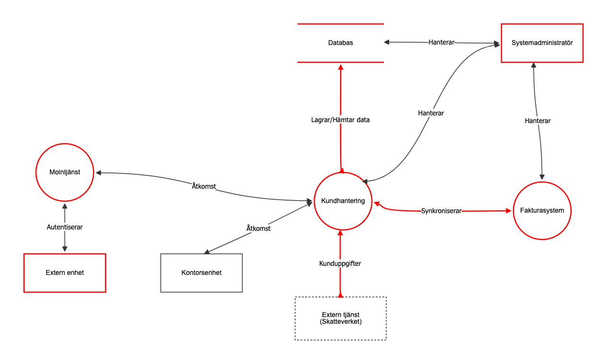
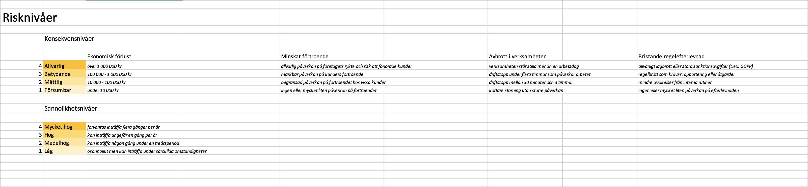

# Risk Analysis and Threat Modeling

This repository contains a threat model and a risk analysis for a small business system that manages customers, orders, and invoices.

The project was completed as part of an Information Security course.

## Objective

The objective was to analyze a provided system model, identify relevant information security threats, classify them using the CIA triad, and perform a structured risk assessment based on likelihood and consequence.

## System Overview

The business system consists of:

- Customer management
- Invoice system
- Database
- Cloud service
- Mobile devices used by field personnel
- External integration (Swedish Tax Agency)

## Methodology

A pre-defined system model provided as part of the course assignment was analyzed using **OWASP Threat Dragon**.

Information assets and data flows were reviewed, and identified threats were classified according to the **CIA triad**:

- Confidentiality
- Integrity
- Availability

The risks were documented in a structured risk register and assessed based on:

- Likelihood (1–4)
- Consequence (1–4)
- Overall risk level

## Tools

- OWASP Threat Dragon
- Microsoft Excel

## Files

- `hotmodell-lineg196.json`
- `riskanalys-lineg196.xlsx`

## Screenshots

### Threat model

### Risk matrix

